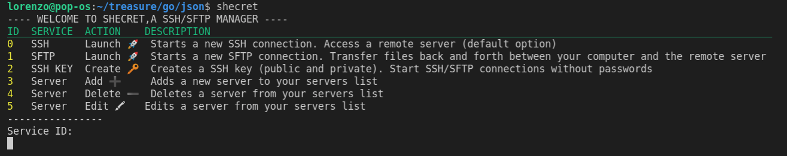

# Schecret

## Description

Schecret is SSH/SFPT client, easily managed managed via command line, so it is very fast!

## Features

## Run without Go

|Windows|Linux
|--|--|
|`shecret.exe`|`shecret`

## Build .exe (Windows)
    env GOOS=windows go build

## Build binary (Linux)
    env GOOS=linux go build